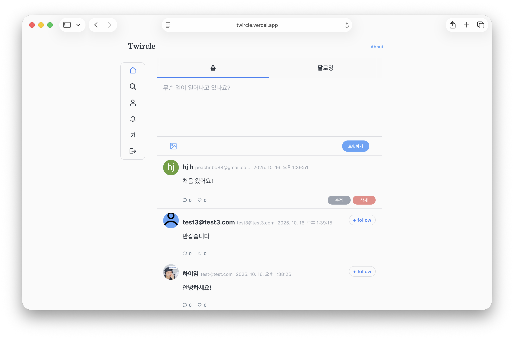

# 💬 twircle


🔗 **Demo:** [twircle](https://twircle.vercel.app/)

  <br/>

## 📌 프로젝트 개요

- **twircle**은 사용자의 일상과 생각을 공유할 수 있는 **트위터 UX를 모티브로 한 실시간 반응형 소셜 네트워크 서비스**입니다.
- 사용자는 글 작성 및 검색, 이미지 업로드, 댓글/대댓글, 좋아요, 팔로우, 실시간 알림 기능을 통해 실제 SNS와 유사한 경험을 할 수 있습니다.
- 특히 Firebase Firestore 실시간 구독(`onSnapshot`)을 활용하여 타임라인, 댓글, 알림이 즉시 반영되도록 구현했으며, Firebase Auth 기반으로 로그인/회원가입을 구현하고, Context API로 인증/팔로우/언어 상태를 전역 관리해 불필요한 리렌더링을 최소화했습니다. 이 외에도 해시태그 기반 검색을 지원합니다.
- 본 프로젝트는 단순 UI 복제를 넘어, 실시간 데이터 흐름과 일관된 상태 관리, UX 최적화를 통해 현대 프론트엔드 개발의 핵심 역량을 종합적으로 구현했습니다.
  <br />

## 💡 주요 기능

### ✅ 실시간 데이터를 반영한 타임라인

- Firebase Firestore `onSnapshot`을 활용해 타임라인, 댓글, 알림이 즉시 반영됩니다.
- 사용자가 좋아요한 글과 팔로잉한 사용자의 글이 실시간으로 업데이트됩니다.

### ✅ 소셜 계정(OAuth) 간편 로그인

- Firebase Auth의 OAuth Provider(Google, GitHub)를 Promise 기반 인증 흐름으로 안전하게 연결하여, 별도 회원가입 절차 없이 소셜 계정으로 로그인할 수 있습니다.

### ✅ 해시태그 하이라이팅 (contentEditable 기반) 및 검색

- `contentEditable` 편집 영역에서 입력 중 **해시태그(#tag)** 를 자동 감지해 색상 하이라이트 처리합니다.
- **한국어 입력기(IME)** 사용 시 IME 입력 확정(`compositionend`) 타이밍을 감지하여, 입력이 확정된 후에만 파싱 및 하이라이팅이 적용되도록 했습니다.
- 게시글 내 해시태그를 클릭하면 해당 해시태그 검색 결과를 확인할 수 있습니다.
- 검색 정확도를 높이기 위해 게시글 텍스트를 토큰화하였으며, Firestore 문서에 keywords 필드에 저장하여 전역 검색이 가능하도록 했습니다.

### ✅ 팔로우/팔로잉 기능

- 사용자 간 팔로우/언팔로우를 통해 맞춤형 피드를 구성할 수 있습니다.
- 팔로우 이벤트 발생 시 실시간 알림이 전달됩니다.

### ✅ 댓글 & 대댓글 (트리 구조)

- 모든 게시글에 댓글 작성이 가능하며, 각 댓글에 대댓글(계층형 댓글)을 작성할 수 있습니다.
- 댓글과 대댓글은 **parentId**와 **conversationId** 기반 트리 구조로 관리되어 대화 흐름을 직관적으로 파악할 수 있습니다.
- 삭제된 댓글은 ‘삭제된 댓글입니다’로 대체 렌더링하여 트리 구조와 대화 맥락을 유지했습니다.

### ✅ 실시간 알림(Notification)

- 댓글 작성, 좋아요, 팔로우 이벤트 발생 시 상대방에게 실시간 알림이 전달됩니다.
- 알림 문서는 `/users/{uid}/notifications`에 저장되며, 읽음 여부를 관리합니다.
- 알림 확인 시 읽음 처리되며, 해당 게시글/댓글/프로필 페이지로 즉시 이동할 수 있습니다.

### ✅ 다국어 기능 지원

- 글로벌 사용자 경험을 고려한 다국어 지원을 제공합니다.
- `useTranslation` 커스텀 훅을 이용해 UI 텍스트를 한국어/영어로 전환할 수 있습니다.

  <br/>

## 🔎 역할과 기여도

- 개인 프로젝트로 **기획부터 설계, 개발, 배포까지 프론트엔드 전 과정을 단독으로 주도**하였습니다.
- **React + TypeScript 기반 아키텍처 설계**를 통해 컴포넌트 재사용성과 유지보수성을 확보하였습니다.
- **실시간 데이터 처리**
  - Firestore `onSnapshot`을 적용해 타임라인, 댓글, 알림이 즉시 반영되도록 구현
  - 지연 없는 데이터 반영으로 SNS 특유의 **실시간성 UX**를 제공
- **소셜 로그인 및 인증**
  - Firebase Auth + Google/GitHub OAuth 연동
  - 별도의 회원가입 절차 없이 **간편 로그인 UX**를 구축
- **댓글 & 대댓글 트리 구조**
  - `parentId`, `conversationId`를 이용한 재귀 렌더링 트리 구조로 계층형 대화 지원
  - 삭제 댓글은 “삭제된 댓글입니다”로 표시해 **대화 맥락을 유지**
- **해시태그 기반 검색**
  - `contentEditable` 기반 에디터를 구현하여 입력 시 해시태그 자동 하이라이팅
  - 해시태그/키워드 검색을 지원해 **콘텐츠 탐색 경험**을 강화
- **실시간 알림(Notification)**

  - 댓글, 좋아요, 팔로우 이벤트 발생 시 `/users/{uid}/notifications` 경로에 알림 생성
  - Firestore `onSnapshot`을 활용해 알림을 실시간 전달, **사용자 간 상호작용을 강화**

  <br/>

## 🏗️ 시스템 아키텍처

  
 <br/>

## 📁 프로젝트 구조

> 기능 단위로 폴더를 분리한 **Feature-based 구조**로 설계하였으며,  
> 컴포넌트, 상태, 훅, 라우팅이 명확히 구분되도록 구성했습니다.

```
src
┣ components/ # UI 단위 컴포넌트 (Menu, Post, Comment 등)
┣ constants/ # 상수 정의
┣ context/ # 전역 상태 (Auth, Following, Language)
┣ hooks/ # 커스텀 훅 (데이터 처리, 폼, 액션 로직 분리)
┣ lib/ # 텍스트 파싱 및 커서 제어 유틸리티, Firebase 연동 로직 (댓글, 팔로우, 좋아요 알림 로직)
┣ pages/ # 라우팅별 페이지 (home, posts, profile, search 등)
┣ routes/ # React Router 설정
┣ styles/ # 전역 스타일, SCSS 변수 및 믹스인 관리
┣ firebaseApp.tsx # Firebase 초기화 및 환경 설정
┣ App.tsx # 루트 컴포넌트
┗ main.tsx # 진입 파일
```

<br/>

## 🛠️ 사용한 기술 스택

| 분류                 | 기술/도구                                                |
| -------------------- | -------------------------------------------------------- |
| **Frontend**         | React, TypeScript, React Router DOM                      |
| **State Management** | Context API                                              |
| **Database & Auth**  | Firebase (Auth, Firestore, Storage)                      |
| **UI / Animation**   | SCSS Modules, Framer Motion, react-icons, React Toastify |
| **Form & Utility**   | React Hook Form, uuid                                    |
| **Deployment**       | Vercel                                                   |

  <br/>

## 🚀 배포 방법

### 🔹 자동 배포 (권장 방식)

- **Vercel**과 **GitHub 저장소**를 연동하여, main 브랜치에 코드를 push하면 자동으로 CI/CD 파이프라인이 실행됩니다.
- `Preview Deploy`와 `Production Deploy` 환경을 분리 운영
  - **Preview**: Pull Request 또는 브랜치 푸시 시 임시 URL이 생성되어 테스트 및 검증 가능
  - **Production**: main 브랜치에 merge되면 자동으로 프로덕션 도메인에 반영

### 🔹 수동 배포 (CLI)

- Vercel CLI를 이용해 로컬에서 직접 배포할 수 있습니다.

```bash
vercel        # Preview 배포
vercel --prod # Production 배포
```

### 🖥️ 로컬 실행 방법

1. 프로젝트 클론 & 의존성 설치

```bash
# 프로젝트 클론
git clone https://github.com/eileen819/twircle.git
cd twircle

# 의존성 설치
npm install
```

2. 개발 서버 실행

```bash
# Vite 개발 서버 실행
npm run dev
```

3. 빌드 결과 보기

```bash
npm run build
npm run preview
```

  <br/>

## 🔄 개선 예정 기능 (업데이트 계획)

### ✔️ 리트윗 기능

- 다른 사용자의 게시글을 자신의 피드에 공유할 수 있도록 구현 예정
- 사용자 간 상호작용과 콘텐츠 확산 강화

### ✔️ 북마크 기능

- 마음에 드는 게시글을 저장하고 모아볼 수 있도록 구현 예정
- 개인화된 콘텐츠 관리 경험 제공

### ✔️ 다크모드 / 라이트모드

- 다크모드/라이트모드 전환 기능을 지원 예정
- 접근성과 가독성을 개선하여 다양한 사용자 환경에 대응

### ✔️ 실시간 채팅 기능

- Firebase Realtime Database 또는 Firestore `onSnapshot`을 활용해 1:1 및 그룹 채팅 구현 예정
- 즉각적인 메시지 송수신과 읽음 표시를 통해 실시간 커뮤니케이션 경험 제공

  <br/>

## 📚 기술적 학습 및 인사이트

### 📍 실시간 데이터 처리 경험

- Firestore `onSnapshot`을 적용해 실시간 데이터 구조 설계와 리소스 최적화에 대한 감각을 키웠습니다.
- 중복 구독으로 인한 성능 저하 문제를 겪으며, 구독 최적화와 리소스 관리의 중요성을 배웠습니다.

### 📍 OAuth 인증 흐름 이해

- Firebase Auth로 Google/GitHub 소셜 로그인을 구현하는 과정에서 **Provider 간 계정 충돌 문제**를 직접 해결했습니다.
- `account-exists-with-different-credential` 에러를 다루며 **안정적인 인증 UX 설계**의 필요성과 예외 상황 중심 설계(Exception-driven design)의 중요성을 체득했습니다.

### 📍 에디터 UX 개선과 IME 처리

- `contentEditable` 기반 해시태그 하이라이팅을 구현하며, 한국어 입력 시 `composition` 이벤트를 고려하지 않으면 버그가 발생한다는 점을 배웠습니다.
- 이를 통해 **실제 사용자 입력 흐름에 맞춘 에디터 로직 설계**의 중요성을 체감했습니다.

### 📍 동시성 문제와 데이터 일관성

- 다수 사용자가 동시에 좋아요를 누를 때 상태 불일치가 발생해, Firestore `transaction`으로 다중 사용자 환경에서 데이터 정합성(Consistency) 보장의 핵심 개념을 학습했습니다.
- 이를 통해 데이터 정합성 보장 및 예외 중심 설계(Exception-driven design)의 중요성을 체득했습니다.
